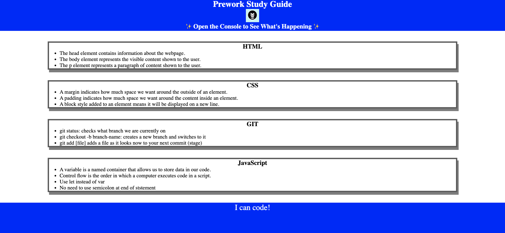

# Prework Study Guide Webpage

## Description

This Prework Study Guide was created for boot camp students who were going through the Prework. It contains notes on HTML, CSS, Git, and JavaScript.

## Installation

N/A

## Usage

To use this Prework Study Guide, you can review the notes in each section. For suggestions on what to study first, open the Chrome DevTools by pressing Command+Option+I (macOS) or Control+Shift+I (Windows). A console panel should open either below or to the side of the webpage in the browser. There you will see a list of topics we learned from the prework along with a suggestion on which topic to study first.

The finished index.html page looks like the following screenshot:

## Credits

[shields.io](https://shields.io/)

### Tutorials Used:

- [Markdown Guide](https://www.markdownguide.org/)
- [JavaScript Variables](https://www.w3schools.com/js/js_variables.asp)
- [Your Guide to Semicolons in JavaScript](https://www.codecademy.com/resources/blog/your-guide-to-semicolons-in-javascript/)

## License

Please refer to the LICENSE in the repo.
